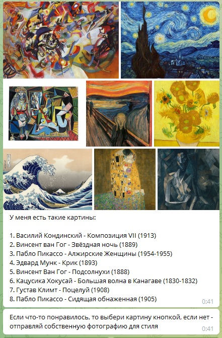
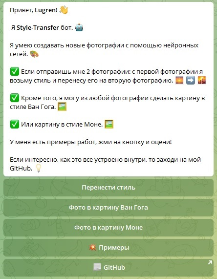
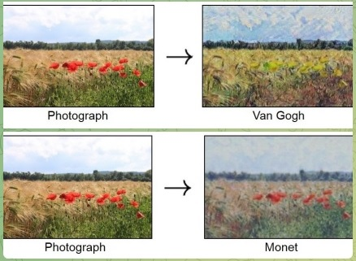

## <p align="center">Телеграм бот</p>

Это Style Transfer Telegram бот, который умеет переносить стиль с одной фотографии на другую как с помощью классического алгоритма Гатиса так и с использованием CycleGAN.
Для написания бота использовалась библиотека aiogram для создания асинхронной архитектуры.
Код телеграм бота находится в файле *bot.py*. В файле *keyboards.py* находятся используемые клавиатуры и длинные сообщения.



### Основной функционал бота:
1. Перенос стиля:
   * Для работы необходимо осначала отправить фотографию стиля, а потом фотографию, на которую требуется перенести выбранный стиль.
   * Есть возможность выбора заранее предустановленных стилей выполненных на основе 8 всемирно известных картин.
2. Использование CycleGAN:
   * Превратить фотографию в картину, выполненную в стиле работ Ван Гога.
   * Превратить фотографию в картину, выполненную в стиле работ Моне.
3. Бот может показать примеры, получаемые в результате выполнения 3 вышеуказанных алгоритмов.
4. Перенаправить на репозиторий с проектом.  



### Особенности:
1. Запоминание пользователей и отправляемых ими фотографий реализовано через словарь, в котором сохраняются объекты класса для каждого пользователя, начавшего общение с ботом. В объекте класса хранится id пользователя, название выбранного алгоритма и фотография стиля (в случае использования Style Transfer). Фотография контента и фото для CycleGAN не сохраняются, а передаются напрямую в пайплайн выбранного алгоритма.
2. Бот отдает фотографию в том же разрешении, что и получил от пользователя. Так как для моделей необходимы квадратные фотографии, то используются паддинги.
   * StyleTranfer: сжатие до 250 пикселей (оптимальное время\качество).
   * CycleGAN: сжатие до 512 пикселей.
3. Алгоритмы запускаются в отдельном потоке с помощью *threading.Thread*.
4. Длительность работы:
   * StyleTrasfer: в среднем до 5 минут.
   * CycleGAN: в среднем до 15 секунд.

## StyleTransfer
Для переноса стилей с помощью классического алгоритма Гатиса было выполнено следующее:
1. Взята предобученная на датасете Imagenet модель VGG19.
2. Модель была дообучена на датасете Caltech 101, содержащим 8677 изображений в 101 категории. Код обучения представлен в файле *model_nst/train_vgg19.ipynb*.
3. С целью оптимизации и экономии вычислительных ресурсов, были сохранены веса только первыx 11 слоёв модели в файл *models_wts/vgg19.pth*.
4. Алгоритм переноса стиля использует итеративное изменение входной картинки на основе разницы между style и content картинками.

## CycleGAN
Для реализации CycleGAN был взят код junyanz [pytorch-CycleGAN-and-pix2pix](https://github.com/junyanz/pytorch-CycleGAN-and-pix2pix), который, в свою очередь, ссылается на jcjohnson [fast_neural_style](https://github.com/jcjohnson/fast-neural-style).
Код дает возможность использовать CycleGAN и pix2pix модели в различных режимах и на различных датасетах.



Перед использованиям в целях оптимизации были выполнены следующие действия:
1. Архитектура CycleGAN применяется только в режиме для теста, чтобы позволяет генерировать изображения только в одну сторону (папка *models*)
    * Модель принимает на вход изображения, а не датасет.
    * Убраны неиспользуемые функции.
    * Модель сразу возвращает результат генерации.
2. Пост- и предобработка фотографий делается собственными функциями.
3. Используются параметры для запуска скрипта в тестовом режиме (папка *options*).
4. Все функции использующие датасеты вместо изображений удалены.
5. В папке *scripts* лежит скрипт для загрузки весов предобученного CycleGAN. Для загрузки необходимо перейти в папку с CycleGAN и запустить скрипт с выбранными весами. Все веса загружаются в папку *checkpoints*
```
$ cd model_cyclegan
$ bash ./scripts/download_cyclegan_model.sh style_vangogh
```
6. Для того, чтобы избежать сложного создания модели, скрипт test.py был исправлен таким образом, чтобы создать модель со стандартными параметрами и сразу сохранять ее в файл pth для дальнейшего использования ботом. Модели сохраняются в папку *models_wts*. Скрипт *test.py* запускается следующим образом:
```
$ cd model_cyclegan
$ python test.py --name style_vangogh_pretrained --model test --no_dropout --gpu_ids -1
```
gpu_ids равен -1, так как подразумевается использование модели только на CPU.

## Библиотеки необходимые для работы
В связи с тем, что все вычисления выполняются на CPU, установлены СCPU версии Torch и Torchvision.  
Проект был собран на Python версии 3.9.0
```
aiogram==2.19
Pillow==9.0.1
torch==1.10.2
torchvision==0.11.3
python-dotenv==0.19.2
```

## Структура репозитория
| |                  | Описание файлов и папок                           |
| --- |------------------|---------------------------------------------------|
| images |                  |                                                   |
|  | examples         | Изображения с примерами работы модели                             |
|  | styles           | Предустановленные изображения со стилями                       |
| model_cyclegan |                  |                                                   |
|  | checkpoints      | Директория для загрузки весов для создания СycleGAN          |
|  | models           | Архитектура СycleGAN                              |
|  | options          | Параметры для создания СycleGAN                   |
|  | scripts          | Скрипт для загрузки весов CycleGAN         |
|  | CycleGAN.py      | Пайплайн СycleGAN                             |
|  | test.py          | Скрипт для создания моделей с загруженными весами |
| model_nst |                  |                                                   |
|  | StyleTransfer.py | Модель и пайплайн для StyleTransfer               |
|  | train_vgg19.ipynb   | Дообучение модели VGG19 на датасете ScalTech      |
| models_wts |                  | Веса для всех моделей                             |
| bot.py |                  | Код телеграм бота                                 |
| keyboards.py |                  | Клавиатуры и сообщения для бота                   |
| image_processing.py |                  | Запуск пайплайнов для NST и CycleGAN              |
| requirements.txt |                  | Необходимые пакеты                                |
| .env |                  | Файл с переменными окружения                               |

